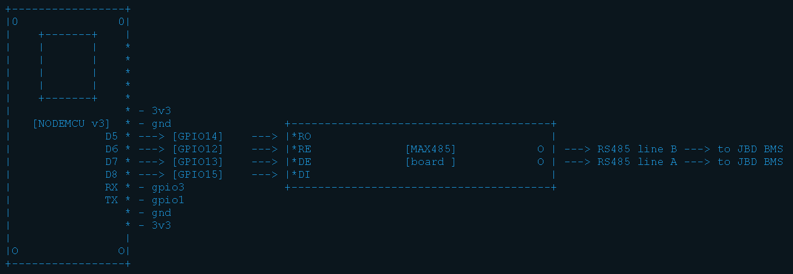
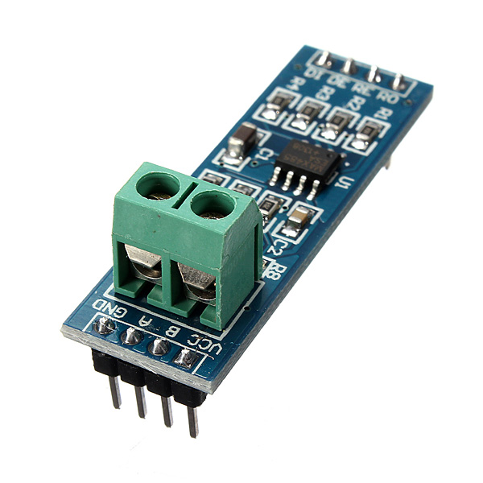
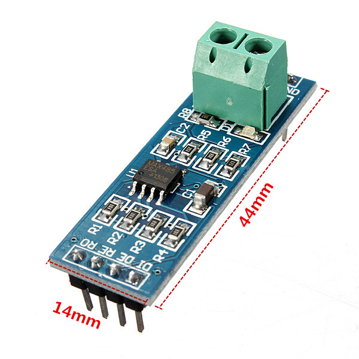

The Arduino-style library, used for communication with JBD BMS-es via serial port,
forked here:

        https://github.com/FurTrader/Overkill-Solar-BMS_2-Arduino-Library

The library was adapted to communicate the MCU via rs485 little boards and a two-pins port on JBD BMS marked as "RS485"

  
 

---

In my own battery setup I'm using the :

<ul>
<li>JBD-SP04S020A - the BMS board</li>
<li>MAX485 - communication module</li>
<li>NodeMCU v3 - the dev board</li>
<li>...and this library :)</li>
</ul>

 <!-- 
 Few lines describing your project. -->

The MAX485 module works wery symple: RO and DI pins should be connect to RX and TX, and RE - DE should receive the same signals from MCU, they should switch the max485 between (RX) and (TX) states.  So if you want to use the rs485 port you need to introduce two functions, that will be switch the RE-DE pin(s) to logical UP or DOWN:  

<pre>
void preTransmission()
{
  digitalWrite(MAX485_RE, 1);
  digitalWrite(MAX485_DE, 1);
}

void postTransmission()
{
digitalWrite(MAX485_RE, 0);
digitalWrite(MAX485_DE, 0);
}

</pre>

and than set them to library functions:

<pre>
  bms.begin(&rs485);
  bms.preTransmission(preTransmission);
  bms.postTransmission(postTransmission)
</pre>

All other functions was worked as original script.

